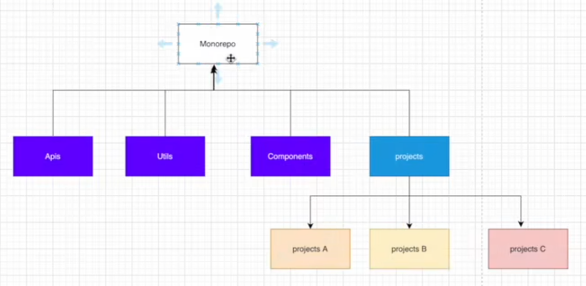
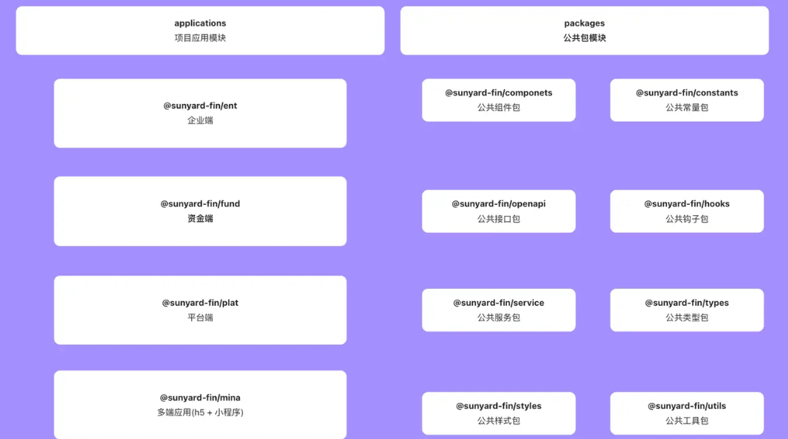

# 相关文档

1. <https://pnpm.io/zh/pnpm-workspace_yaml>
2. <https://cli.vuejs.org/>
3. <https://vitejs.dev/guide/>

## 项目架构图

1. apis 和utils 不需要用到vue所以用vite 脚手架创建
   1. pnpm create vite
   2. vanilla vanilla-ts
2. component 需要用到vue 所以用vue脚手架创建
3. apis 目录中的保留package.json ,index.ts,tsconfig.json，vite-env.d.ts其它都删掉
4. 在apis 根目录创建index.ts 并且在package.json 中配置 "main":"index.ts" 的好处就是在其它项目导入包的时候路径直接写到"@iiii/apis"就可以了

## iiii 项目架构图

